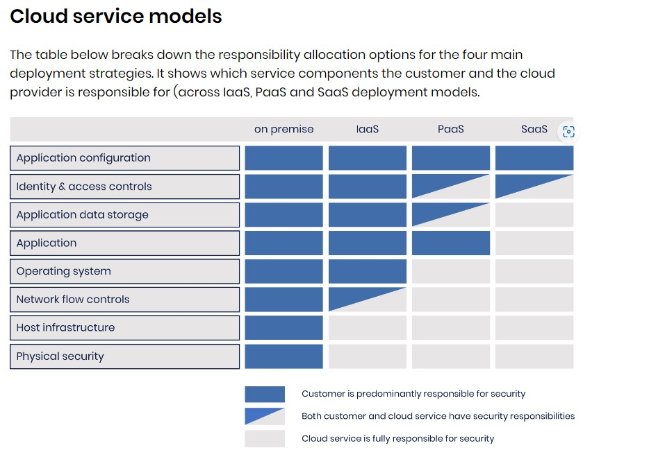

# Cloud Service Models

There are 3 types of service models:

## Software as a Service (SaaS)

The least control for end user, with only basic configuration controls available if any.

## Platform as a Service (PaaS)

While PaaS may be intended for use by developers, there may be some administration of the service by the company as well. In fact, the lines often blur when a corporation enters into a business relationship with a cloud provider but does much of the provisioning and administrative work in house. 

## Infrastructure as a Service (IaaS)

Has the most control for the end user, where operating system selection, configuration, patching, software tools and applications are all controlled by the end user. 

## Shared Responsibility Model

# Cloud Service Capabilities

Capability types are another way to look at cloud service models. In this view, we look at the capapbilities provided by each model. Our three service models are SaaS, PaaS, and IaaS. Each provides a different level and type of service to the customer. The shared security responsibility differ for each type as well. 

## Application Capability Types

Application capabilities include the ability to access an application over the network from multiple devices and from multiple locations. Application access may be made through a web interface, through a thin client, or in some other manner. As the application and data are stored in the cloud, the same data is available to a user from whichever device they connect from. Depending on the end user, the look of the interface may be different. 

Users do not have the capability to control or modify the underlying cloud infrastructure, although they may be able to customize their interface of the cloud solution. What the user gets is a positive experience when working on a laptop or phone. The organization does not have to be concerned with the different types of endpoints in use in their organization (as it relates to cloud service access). Supporting all of the different types of devices is the responsibility of the application service provider. 

## Platform Capability Types

A platform has the capability of developing and deploying solutions through the cloud. These solutions may be developed with available tools, they may be aqcuired solutions that are delivered through the cloud, or they may be solutions that are acquired and customized prior to delivery. The user of a platform service may modify the solutions they deploy, particularly the ones they develop and customize. However, the user has no capability to modify the underlying infrastructure. 

What the user gets in a platform service are tools that are specifically tailored to the cloud environment. In addition, the user can experiment with a variety of platform tools, methods, and approaches to determine what is best for a  particular organization or development environment without the expense of acquiring all those tool and the underlying infrastructure costs. It provides a development sandbox at a lower cost than doing it all in house. 

## Infrastructure Capabillity Types

AN infrastructure customer cannot control the underlying hardware but has control over the operating system, installed tools, solutions installed, and provisioning of infrastructure compute, storage, and network and other computing resources. 

This capability provides the customer with the ability to spin up an environment quickly. The environment may be needed for only hours or days. The parent organization does not have to purchase the hardware or physical space for this infrastructure or pay for its setup and continuing maintenance for usage spikes, temporary needs, or even regular cycles of use. 