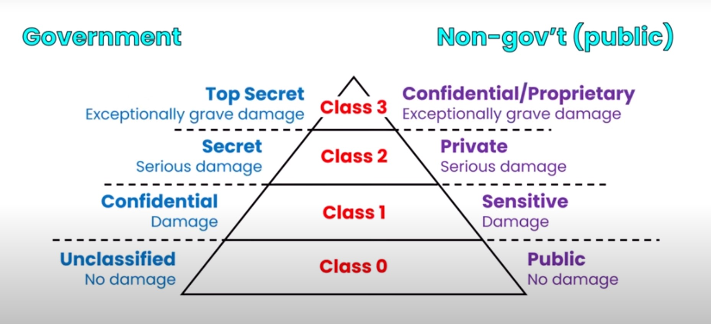

# Data Classification

4 Different classes of data types whether it be government or commercial data types. View the image above to see their corresponding names and where they rank in sensitivity of the data. 

# Common Sensitive Data Types

## Personally Identifiable Information (PII)

Information that can identify an individual (name, SSN, birthdate/place, biometric records, etc.)

## Protected Health Information (PHI)

Health-related information that can be related to a specific person.

>Regulated by HIPAA/HITRUST

## Cardholder Data

allowable storage of information related to credit and debit cards and transactions

> Defined and regulated by PCI DSS

# Data Policies

## Data Classification

Labeling/tagging of data based on type, like personally identifiable info (PII), protected health info (PHI), etc.

## Data Retention

Ensures that legal and compliance issues are addressed

## Regulatory Compliance

For legal and compliance reasons, you may need to keep certain data for different periods of time. 
(A driver of classification and retention)

> **Examples:**
> Some financial data needs to be retained for 7 years and some medical data may need to be retained for up to 20-30 years.

## Data Classification

A process for categorization of data and defining appropriate controls. Categories include

- Data type (format, structure)
- Jurisdiction and other legal contraints
- Ownership, Context
- Contractual or business constraints
- Trust levels and source of origin
- Value, sensitivity, and criticality
- Retention and preservation

> Data should be classified as soon after creation as possible. 

# Data Mapping and Labeling

## Data Mapping

Informs the organization of the locations where data is present within applications and storage

Brings understanding that enables implementation of security controls and classification policies
(Usually precededs classification and labeling)

## Data Labeling

Labeling requirements that apply consistent markings to sensitive data should accompany classification.

Often applied through classification policies, providing a target for data protection.(Often applied in bulk using classification tools)