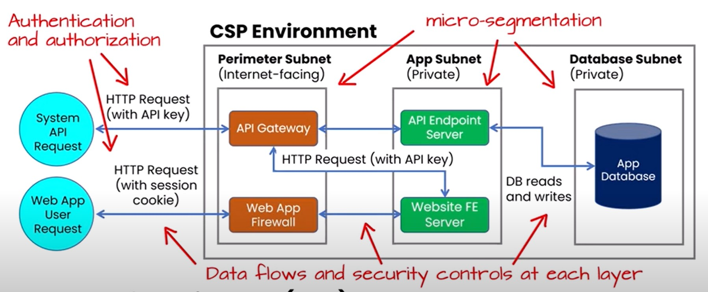

# Data Flows

A ***Data Flow Diagram (DFD)*** is useful to gain visibility and ensure that adequate security controls are implemented

Map out infrastructure, data flows, security controls, and where they sit and how they interact to give you a more broad idea of what is happening and how to protect it.

## Benefits

Decreased development time and faster deployment of new system features. (and with reduced security risk)

Visibility into data movement, critical for regulatory compliance, where data security is often mandated in law. 

Some compliance frameworks require DFDs to capture specific information, such as geographic location of data flows or ownership of systems where data is flowing

> ***Bottom Line:*** Creating the DFD can be both a risk assessment activity and a crucial compliance activity